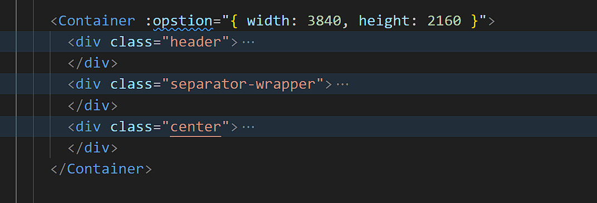
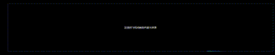
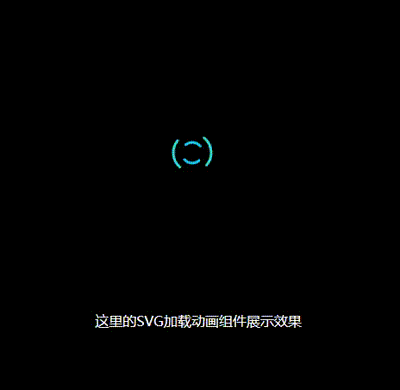

<div  class="box"  style="    display: flex;    justify-content: center;    align-items: center;    flex-direction: column; ">  <h1 align="center">Welcome to RollupLibsForVueTemplate 👋</h1> 
     <h2 align="center"> 一款开箱即用的Rollup搭建的vue组件库  😀</h2> 
     <h2 align="center"> CoderJoon  🐂</h2> 


# 该组件库内置3款适用于可视化大屏的常见组件

tips：本人前端功力尚浅，如有Bug轻点喷！

## Container组件

测试状态：好使:smile:

建议在您的大屏项目中在最外层父组件套一层Container该组件需要传递一个opstion，根据您家ui设计稿传递哈直接实现4K 2K 适配效果哦！解放双手

 

## FlyBox组件

测试状态：好使:smile:

你只需要在你需要使用飞线动画的地方包裹一下这个组件你就可以使用飞线了

```vue
<template>
  <div class="testWrapper">
    <FlyBox>
      <div class="compname">这里的飞线动画组件展示效果</div>
    </FlyBox>
  </div>
</template>
```




## Loading组件

测试状态：好使:smile:

```vue
  <div class="testWrapper">
    <SvgLoading>
      <div class="compname">这里的SVG加载动画组件展示效果</div>
    </SvgLoading>
  </div>
```




## 


# 如何使用？

第一步把我们的项目clone下来 

第二步创建一个崭新的vue项目 注意如果你用的webpack继续看 如果你用的vite先别跟着操作

第三步安装依赖 npm i 

第四步打开控制台执行build 

```shell
PS C:\Users\Joon\Desktop\datavEchartsScreenLibs-main> npm run build:prod
```

第五步切换到 dist目录下

```sh
PS C:\Users\Joon\Desktop\datavEchartsScreenLibs-main> cd .\dist\
```

第六步在dist目录下执行 (或者npm link  xxxx都行看你自己想法)

```shell
PS C:\Users\Joon\Desktop\datavEchartsScreenLibs-main\dist> npm link echarts-screen-libs
```

第七步在你创建的vue项目下面执行

```shell
PS C:\Users\Joon\Desktop\my-vue-app> npm link echarts-screen-libs
```

这是本地关联教程 你如果发布到npm仓库了你就直接npm i xxx就行

别急 ：

我们这个项目使用Rollup打包了两个版本

```js
  output: [
        {
            file: outputPathUmd,
            format: "umd",
            name: "screenDatav",
            globals: {
                vue: "vue"
            }
        },
        {
            file: outputPathejs,
            format: "es",
            name: "screenDatav",
            globals: {
                vue: "vue"
            }
        },

    ],
```

一个是umd版本一个esmodule版本

你如果是webpack创建的项目

在我们的项目根目录中的package.json中的main这一项修改为screendataves这个文件

```
 "main": "./dist/screendataves.js",
```

你如果是Vite创建的项目

在我们的项目根目录中的package.json中的main这一项修改为screendatav这个文件

```
 "main": "./dist/screendatav.js",
```

## 最后

感觉忙碌一晚上各种报错各种解决 没有写出优秀的轮子没啥意思 就当个开箱即用的组件库吧

你可能会遇到一个问题我总结好了再小破站

https://www.bilibili.com/video/BV1Ny42187eb/?spm_id_from=333.999.0.0&vd_source=a3adab8e873be00a01fbf1a6e28f0f61

我的博客也有文字教程手把手教你怎么搭建组件库

csdn:我叫汪枫
